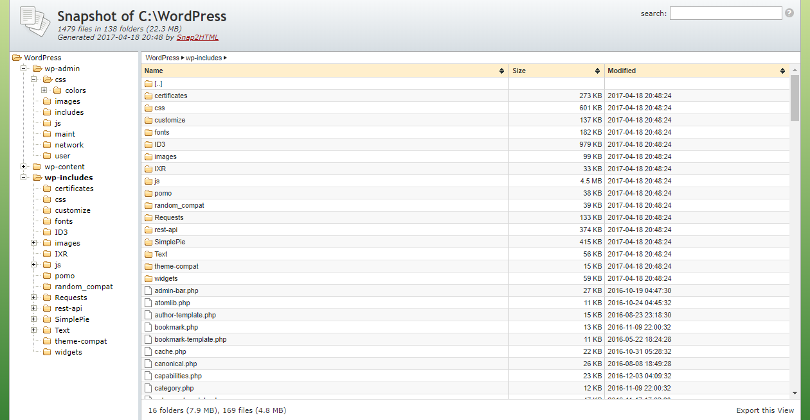

<div align="center">

</div>
 <div align="center">
 


</div>
 
# gdrive-dir2html

This is a small Jupyter Notebook Script that will generate an standalone single page HTML index of all the Files and Folders in your Google Drive. It can also generate short information like Size and Modified date of these Files & Directories.

It is an alternative to [Snap2HTML](http://www.rlvision.com/snap2html/about.php) but for Linux Machine


# What is it used for ?

There are many reasons for using it. These are often used by users who have large amount of data stored and they do not want to use normal search. Instead they can generate the index and use the search mechanism on gdrive-dir2html to pin point the required files/folders. Likewise, you may have multiple HDD, instead of plugging them each to find your files/folders you can simply generate the dir2html and move from there.


[**example.html**](https://alx-xlx.github.io/gdrive-dir2html/example.html) - https://alx-xlx.github.io/gdrive-dir2html/example.html

**example.png**



# How to generate Google Drive Index HTML

### 1. Run this Colab Script to Index Google Drive
<!-- Open in Colab in Center -->
<a href="https://colab.research.google.com/github/alx-xlx/gdrive-dir2html/blob/master/gdrive_dir2html.ipynb" rel="nofollow"></a>

### 2. Click on Connect

### 3. Connect to your Google Drive
under `Mount Google Drive` you will see a play button, click on it. Allow all the Permissions.

If success you will now see the Google Drive listed as drive on your Notebook's left Panel (you need to select the Files Tab to see it)

### 4. Clone the `gdrive-dir2html` to your Notebook
Run the next cell on your notebook marked as `Run this code to Clone gdrive-dir2html Repo`

### 5. Generate the HTML index of your Google Drive
Run the last code cell, it will prompt to enter the directory you need to index.
If you need to Index any specific directory then browse to that directory in Files TAB on your left Panel and copy the PATH and Paste it to the Prompt. OR if you want to Index your whole Google Drive then you can simply enter `/content/drive`

Press ENTER

### 6. Download Google Drive Index HTML file
on the left Files Panel you will now see the Generated Index File. If not then refresh the File System (NOT your browser)

Example: `index-28-09-2022-05-43-57.html`


<!-- https://i.imgur.com/hCFNHhN.gif -->

<!--  -->

<p align="center"></p>

OR

### 2. Run Locally to Index Local Drives

The program only takes two arguments, the directory to be indexed and the output file name without the extension, so:

```gdrive-dir2html.py /home/user filelist```
 
Will index the contents of /home/user and save them to filelist.html on the current directory. Simple as that


